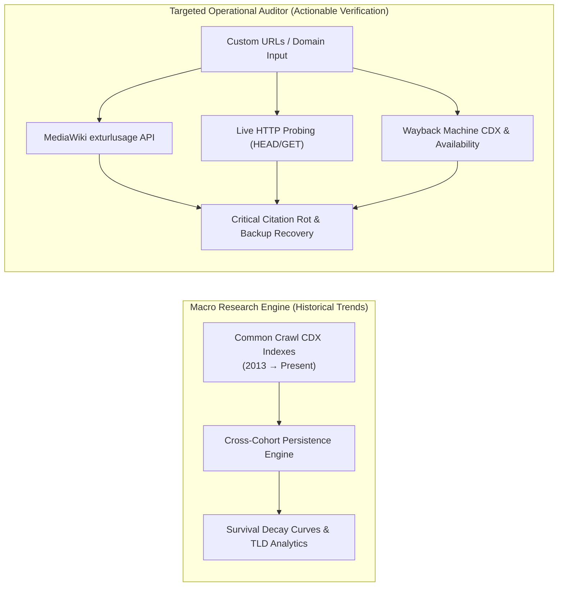
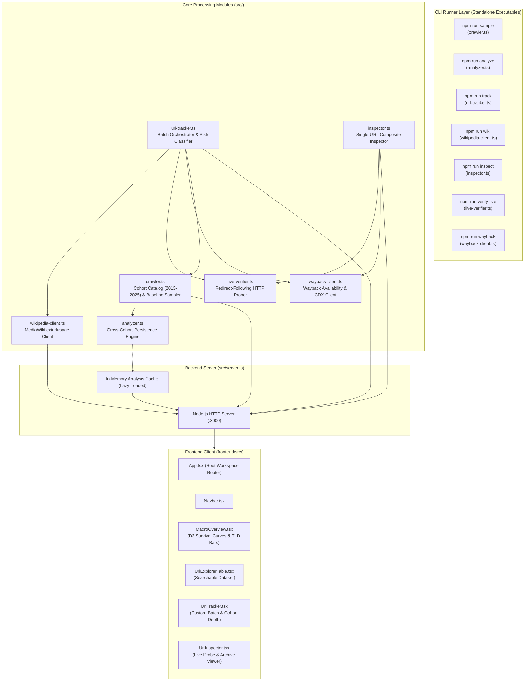
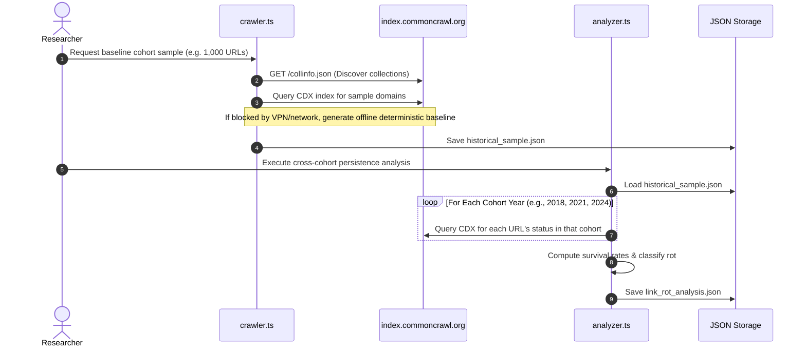
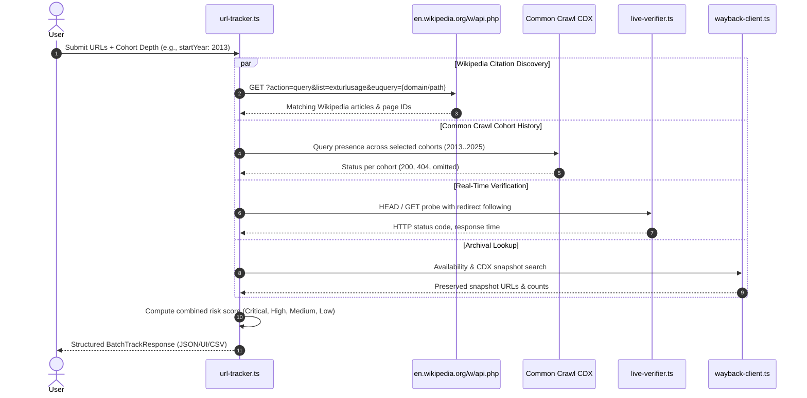
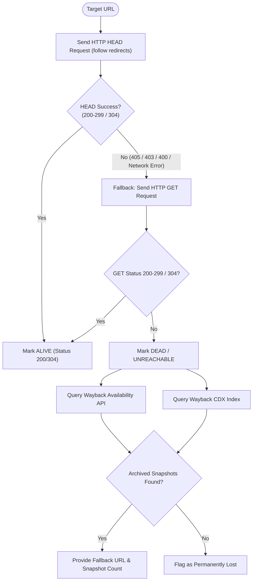
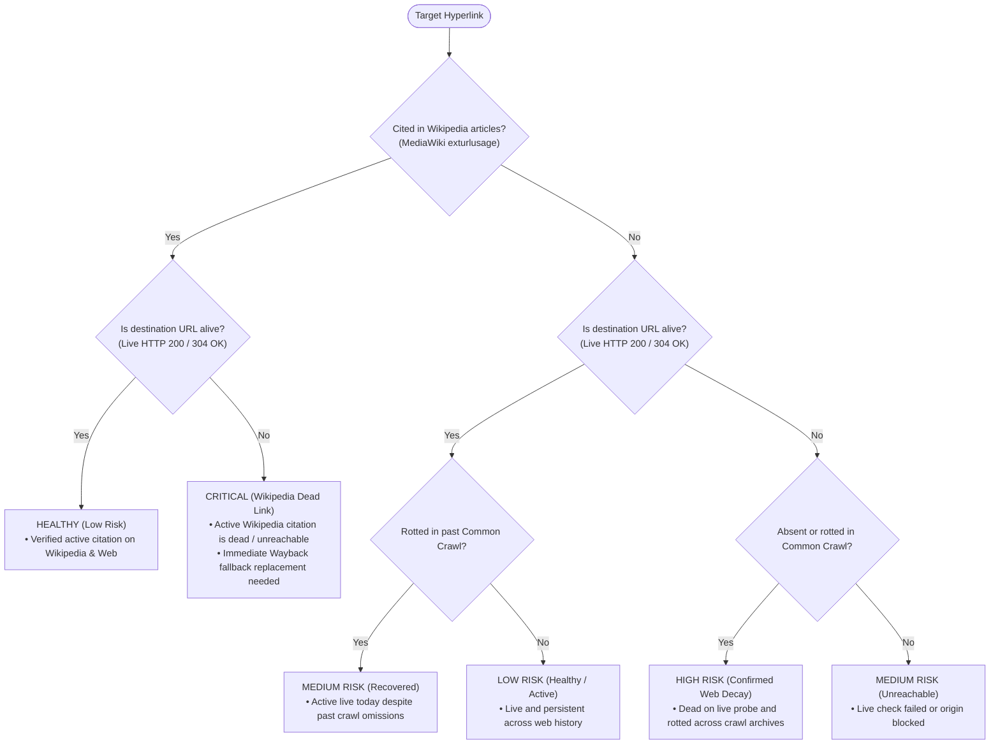
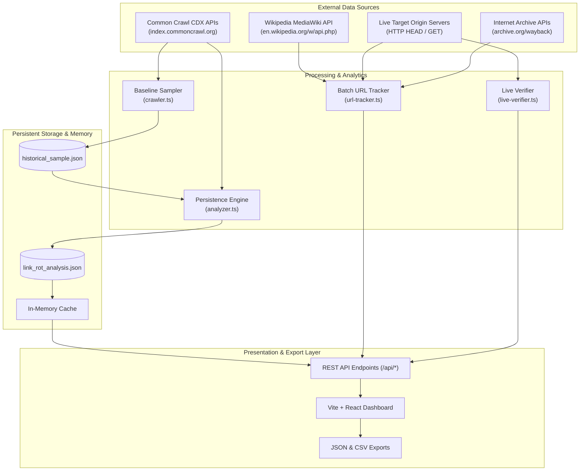

# Link Rot Analyzer: Architectural & Process Explainer

A comprehensive guide explaining **what** the Link Rot Analyzer does, **how** it works under the hood, and **how** its independent modules interconnect.

---

## Table of Contents

1. [High-Level Overview & Core Concepts](#1-high-level-overview--core-concepts)
2. [System Architecture & Component Topology](#2-system-architecture--component-topology)
3. [Deep-Dive: The Core Processes](#3-deep-dive-the-core-processes)
   - [Process A: Macro Historical Decay Modeling (Common Crawl)](#process-a-macro-historical-decay-modeling-common-crawl)
   - [Process B: Wikipedia Citation & Dual-Source Tracking](#process-b-wikipedia-citation--dual-source-tracking)
   - [Process C: Targeted Live Verification & Internet Archive Fallback](#process-c-targeted-live-verification--internet-archive-fallback)
   - [Process D: Interactive UI & D3 Visualization Workspaces](#process-d-interactive-ui--d3-visualization-workspaces)
4. [Component Relationship & Coupling Matrix](#4-component-relationship--coupling-matrix)
5. [Classification Logic & Risk Scoring Engine](#5-classification-logic--risk-scoring-engine)
6. [Data Flow Diagrams](#6-data-flow-diagrams)

---

## 1. High-Level Overview & Core Concepts

Link rot is the process by which hyperlinks on the World Wide Web cease to point to their originally targeted web page, server, or resource over time.

The **Link Rot Analyzer** addresses two distinct challenges in link rot research and remediation:

1. **Macro Web Decay Research**: Quantifies structural decay rates across large longitudinal samples of the web over 5 to 12+ years using [Common Crawl](https://commoncrawl.org/) historical archives.
2. **Targeted / Operational Auditing**: Audits specific arbitrary URLs or domains in real time, determining whether they are actively cited in [Wikipedia](https://www.wikipedia.org/) articles, whether they are currently dead, and whether archival copies exist on the [Internet Archive Wayback Machine](https://archive.org/web/).

---

## 2. System Architecture & Component Topology

The platform is designed with **strict decoupling**—each subsystem can run as a standalone CLI tool, as an isolated API endpoint, or through the unified React frontend.

---

## 3. Deep-Dive: The Core Processes

### Process A: Macro Historical Decay Modeling (Common Crawl)

**Objective**: Model how URLs from an initial baseline cohort (e.g., 2018 or 2013) persist or disappear across subsequent crawl years.

1. **Cohort Discovery**: `crawler.ts` fetches `https://index.commoncrawl.org/collinfo.json` to enumerate all available crawls from 2013 to 2025.
2. **Baseline Sampling**: A diverse sample of URLs is captured from the earliest cohort (e.g., `CC-MAIN-2018-17`).
3. **Cross-Cohort Evaluation**: `analyzer.ts` iterates through subsequent crawl snapshots (e.g., 2021, 2024) and queries the CDX index server for each URL.
4. **Persistence Mathematics**:
   $$\text{Survival Rate}(Y) = \frac{\text{Count of URLs alive in cohort } Y}{\text{Total baseline URLs}} \times 100$$
5. **Lazy Loading**: The backend server caches this dataset in memory upon first request to `/api/summary` or `/api/urls`, ensuring instantaneous response times for subsequent queries.

---

### Process B: Wikipedia Citation & Dual-Source Tracking

**Objective**: Allow users to input custom URLs and discover whether those URLs are actively cited in Wikipedia articles, check their historical crawl presence across configurable cohorts, and assess link rot vulnerability.

1. **Normalization**: `normalizeUrlForWikipedia()` strips protocols (`http://`, `https://`) and URL fragments (`#section`), formatting the string for MediaWiki's `euquery` parameter.
2. **MediaWiki Query**: Hits `https://en.wikipedia.org/w/api.php?action=query&list=exturlusage` (restricted to namespace `0` for main encyclopedic articles).
3. **Configurable Historical Depth**: Resolves the exact list of Common Crawl cohorts requested (e.g., full 11+ year depth from 2013, 10-year decade, or custom step intervals).
4. **Parallel Execution**: Uses `Promise.all` with bounded batch concurrency to query Wikipedia, Common Crawl, live HTTP status, and Wayback Machine in parallel.

---

### Process C: Targeted Live Verification & Internet Archive Fallback

**Objective**: Perform high-speed, accurate live HTTP verification and retrieve preserved Wayback Machine fallbacks for broken links.

1. **Smart Probing**: Initiates a fast `HEAD` request to reduce bandwidth. If the origin server rejects `HEAD` (HTTP 405 Method Not Allowed) or blocks automated HEAD requests (HTTP 403/400), it automatically falls back to an HTTP `GET` with complete redirect following.
2. **Reconciliation**: If a URL is missing from historical Common Crawl indexes but responds with `200 OK` on a live check, it is classified as *Recovered / Transient Historical Outage* rather than true link rot.
3. **Dual-API Wayback Search**: Hits both the Internet Archive **Availability API** (for fastest closest snapshot retrieval) and the **CDX Server API** (for total snapshot count and earliest archive date).

---

### Process D: Interactive UI & D3 Visualization Workspaces

**Objective**: Provide an accessible, responsive dashboard that allows researchers to inspect data visually without cross-tab blocking.

- **Workspace Independence**: The React frontend (`App.tsx`) routes between 4 completely decoupled views:
  1. `MacroOverview.tsx`: D3 survival decay curves, donut charts, TLD distributions, top domain statistics.
  2. `UrlExplorerTable.tsx`: Searchable, filterable pagination table for the baseline crawl dataset.
  3. `UrlTracker.tsx`: Interactive multi-URL submission form with cohort preset selection, depth sliders, Wikipedia citation links, and CSV/JSON export.
  4. `UrlInspector.tsx`: Deep-dive live HTTP header inspector and Wayback timeline viewer.
- **Non-Blocking Architecture**: If the macro benchmark dataset is still generating or re-analyzing, users can use the URL Tracker and URL Inspector without interruption.

---

## 4. Component Relationship & Coupling Matrix

| Component | Primary Function | Upstream Dependencies | Downstream Consumers | Standalone CLI Command |
| :--- | :--- | :--- | :--- | :--- |
| **`crawler.ts`** | Common Crawl collection discovery & baseline sampling | Common Crawl Index API | `analyzer.ts`, `url-tracker.ts`, `server.ts` | `npm run sample` |
| **`analyzer.ts`** | Cross-cohort survival modeling & DuckDB analytics | `crawler.ts`, Common Crawl CDX | `server.ts` (lazy cached) | `npm run analyze` |
| **`live-verifier.ts`** | Lightweight HTTP probing & redirect tracing | Node.js native `fetch` | `inspector.ts`, `url-tracker.ts` | `npm run verify-live -- <url>` |
| **`wayback-client.ts`** | Internet Archive snapshot lookup & counts | Wayback Availability & CDX APIs | `inspector.ts`, `url-tracker.ts` | `npm run wayback -- <url>` |
| **`wikipedia-client.ts`** | External citation discovery in Wikipedia articles | MediaWiki API (`exturlusage`) | `url-tracker.ts`, `server.ts` | `npm run wiki -- <url>` |
| **`url-tracker.ts`** | Dual-source batch orchestrator & risk classification | `wikipedia-client`, `crawler`, `live-verifier`, `wayback-client` | `server.ts`, UI (`UrlTracker.tsx`) | `npm run track -- <urls...>` |
| **`inspector.ts`** | Single-URL composite inspection & recommendation | `live-verifier`, `wayback-client` | `server.ts`, UI (`UrlInspector.tsx`) | `npm run inspect -- <url>` |
| **`server.ts`** | Local HTTP REST API & static asset hosting | All `src/` modules | Frontend client (`api.ts`), CLI tools | `npm run server` |

---

## 5. Classification Logic & Risk Scoring Engine

The platform uses a multi-factor risk matrix to classify hyperlinks:

### Risk Tier Definitions

1. **`CRITICAL` (Wikipedia Dead Link Risk)**:
   - **Condition**: Cited as an external reference on one or more Wikipedia pages, but returns `404 Not Found`, connection reset, or HTTP error on real-time verification.
   - **Action**: Immediate archival fallback replacement recommended.
2. **`HIGH` (Confirmed Web Decay)**:
   - **Condition**: Dead on live HTTP verification and absent or rotted across historical Common Crawl snapshots.
3. **`MEDIUM` (Recovered / Historical Crawl Omission)**:
   - **Condition**: Absent or errored in historical crawl archives, but currently responding `200 OK` on live probing.
4. **`LOW` (Verified Active)**:
   - **Condition**: Responding with valid `200 OK` or `304 Not Modified` headers on live probe.

---

## 6. Data Flow Diagrams

### Complete System Data Flow

---

## 7. Summary

The Link Rot Analyzer bridges **macro web preservation research** with **tactical citation auditing**:
- **Independent**: Any component can be executed as a standalone CLI script (`npm run <module>`).
- **Decoupled**: Heavy historical data loading does not block real-time URL tracking or inspection.
- **Accurate**: Combining historical crawl indexes with real-time HTTP verification eliminates false positives from transient crawl omissions.
- **Actionable**: Identifies specific broken citations on Wikipedia and provides immediate Internet Archive Wayback Machine fallback links.
